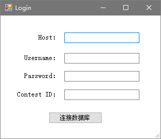
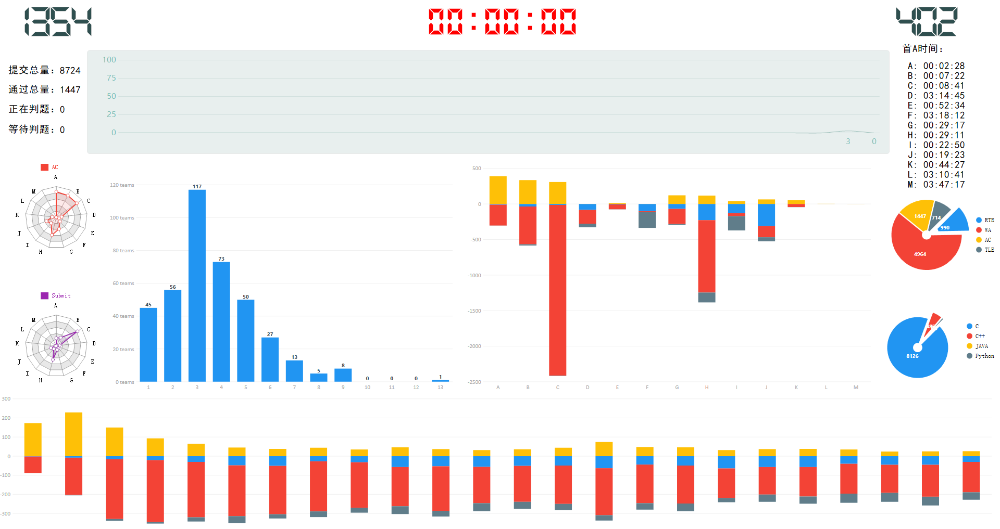
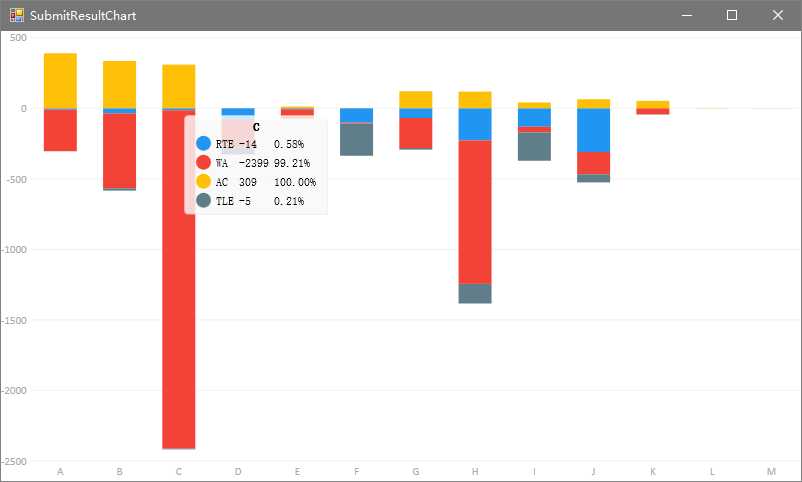
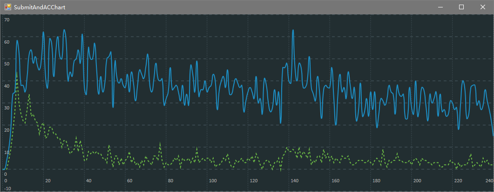
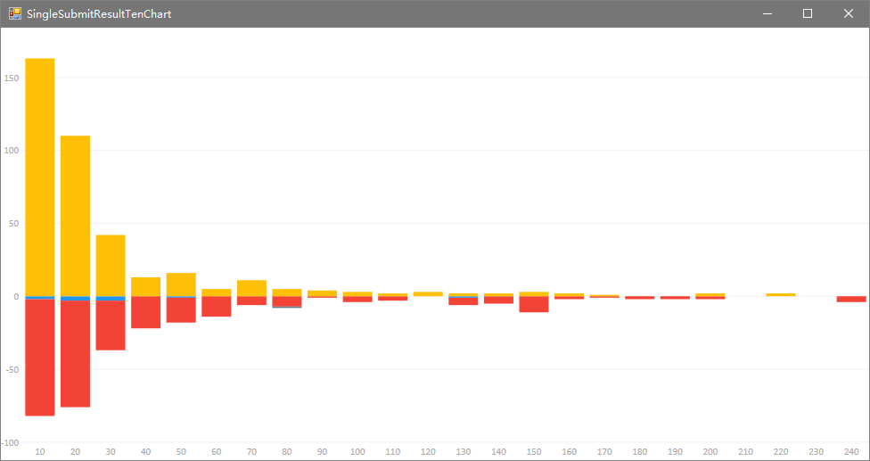
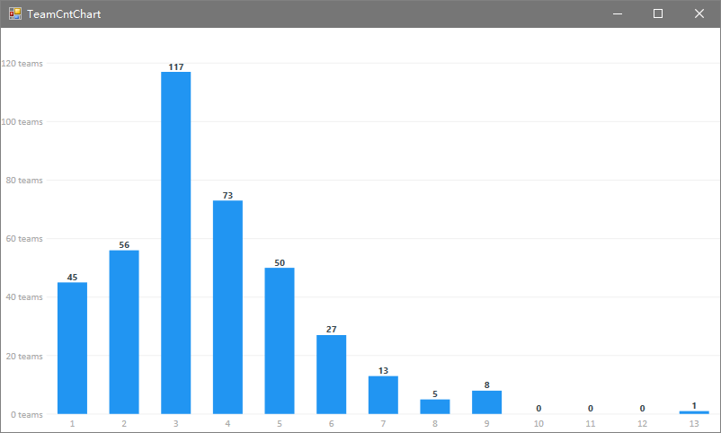
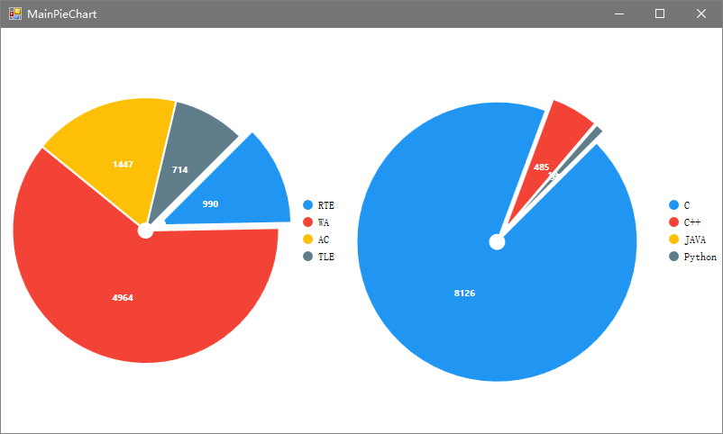
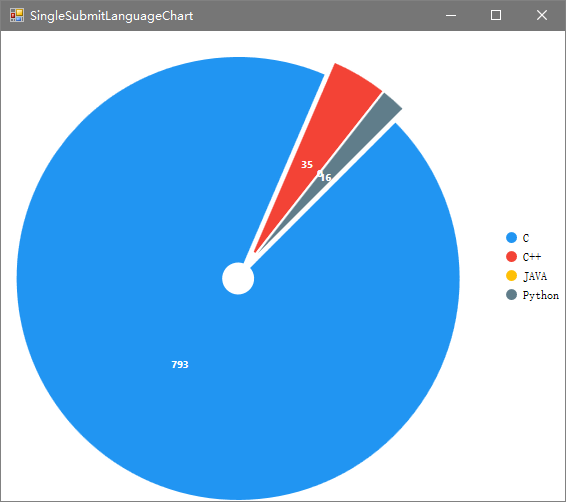
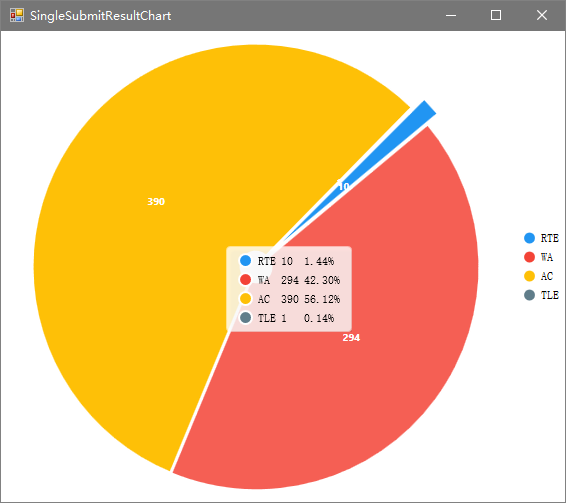
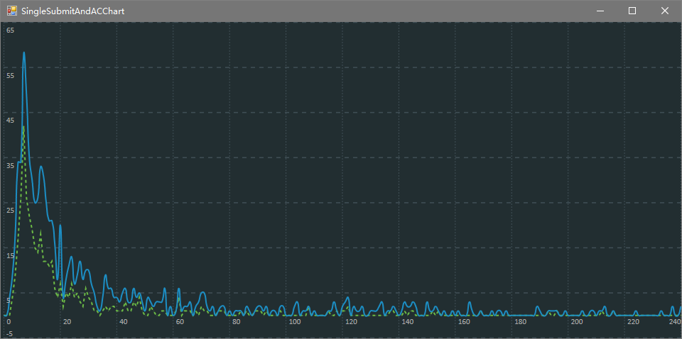

# HZNUOJ-Contest-Monitor

## Quick Start

如果你有 `.Net` 环境的话，直接用 `Visual Studio` 打开 `src/HZNUOJ-Contest-Monitor/HZNUOJ-Contest-Monitor.sln` 然后跑起来就可以了。

目前还没有导出 `exe` 安装包。

## Dependency

- HZNUOJ v2.1
- .NET Framework 4.6.1
- [HZHControls](https://github.com/kwwwvagaa/NetWinformControl)
- [LiveCharts](https://github.com/Live-Charts/Live-Charts)

## Reference

- [一场比赛的缩略视频](./Reference/contest_Time-lapse_photography.mp4)
- [程序说明文档](./Reference/Program_documentation.pdf)
- [简单介绍的Slide](./Reference/Functional_design_document.pdf)

## Screenshot

### 登录界面

### 整体监控界面

### 各题提交类型统计

### 一分钟提交量与通过量统计

### 十分钟提交类型统计

### 过题队伍统计

### 饼状图

### 单题统计

#### 提交语言饼状图

#### 提交类型饼状图

#### 一分钟提交量与通过量统计

#### 十分钟提交类型统计

